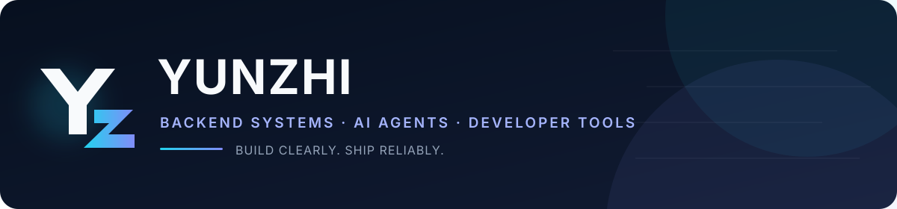

  

  <strong>I turn system ideas into reliable, useful software.</strong> 
  Backend engineering · Multi-agent applications · Developer tools

  <code>Shanghai, China</code>
  <code>Java · Python · Go</code>
  <code>Build clearly. Ship reliably.</code>

## About

I'm **Yunzhi**, a backend and AI builder focused on the parts of software that have to work together: service architecture, data and messaging, LLM orchestration, reliability, and developer experience.

My best work starts with a concrete problem, makes the architecture visible, and ends as something another person can run, inspect, and understand.

## Selected work

| Project | What I built | Engineering focus |
|---|---|---|
| **Aligo** | A Plan-and-Execute multi-agent travel assistant with semantic intent routing, two-tier memory, RAG, and priority-based parallel scheduling. | AgentScope, Python, Redis, PostgreSQL, Milvus |
| **Easy Trans** | A zero-config, cross-platform LAN file-transfer CLI with mDNS discovery, resumable streaming, and SHA-256 integrity checks. | Go, mDNS, HTTP Range, concurrent downloads |
| **Backend Learning Systems** | Runnable, documented labs covering 56 Java backend interview topics, all 23 GoF patterns, messaging, search, and persistence. | Java, Spring Boot, MySQL, Redis, Kafka, RabbitMQ |

Read the engineering decisions and outcomes in the **[project case studies](./PROJECTS.md)**. Source repositories are private while I rebuild a smaller, higher-quality public portfolio.

## Toolbox

  
  
  
  
  
  
  
  
  
  

## How I work

- **Architecture with a reason** — boundaries, data flow, and trade-offs should be explainable.
- **Reliability by design** — retries, circuit breaking, health checks, integrity checks, and observability belong in the system, not in a footnote.
- **Documentation as interface** — a project is not finished until someone else can understand and run it.
- **Evidence over adjectives** — I prefer runnable examples, measured changes, and explicit constraints.

## Let's build something useful

If you're working on backend platforms, AI agents, or developer tools, start a conversation through **[this profile repository](https://github.com/iYunzhi/iYunzhi/issues)**.

  Yunzhi · Build clearly. Ship reliably.

